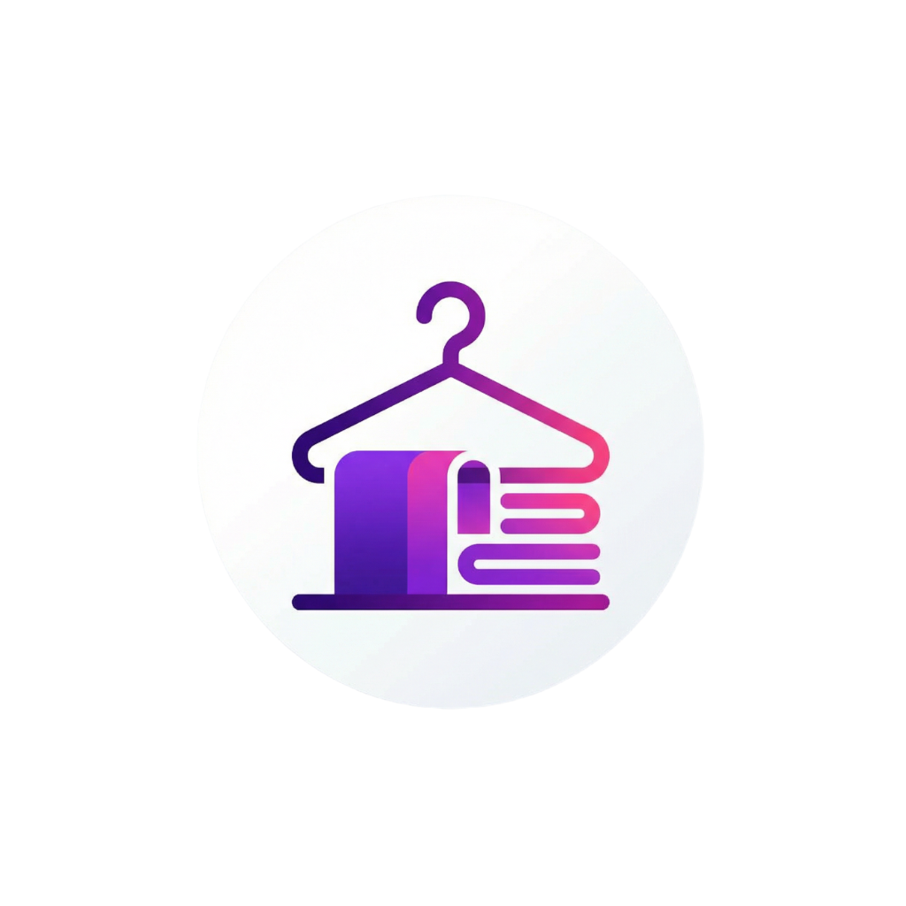

<div align="center">
  
  <h1>ClosetMap - The Wardrobe App</h1>
</div>

<a href="https://github.com/HarshMathur86/Closet-Map-App/releases/download/BETA-version-1.4.0/ClosetMap-Beta-v1.4.0.apk">
  
</a>


ClosetMap is a comprehensive mobile application designed to help you organize and track your wardrobe. It allows you to digitize your closet, manage clothes, and find items quickly.

## Version Information

**Current Release:** v1.4.1
**Release Date:** 2026-02-24

### Release Notes

We are excited to announce the release of version 1.4.1. This release introduces significant improvements and bug fixes.

- **Move Items Between Bags Fixed:** Users can now seamlessly move clothes from one bag to another.
- **Color Selection Palette:** Improved the color selection interface for better usability.
- **Login Experience:** Resolved issues with login expiration after 60 minutes.
- **Barcode Generation Fixed:** The barcode generation system is now fully functional, allowing for reliable bag tracking and organization.
- **Swagger API Documentation:** Added Swagger UI for real-time API exploration and testing (available at `/api-docs` in dev mode).
- **Cloth Inventory:** The core inventory management system is stable and working as expected.
- **Improved TypeScript Configuration:** Resolved JSX configuration issues for a better development experience.

## Known Issues

- **Category Classification:** The current category options are broad. We are working on a more discrete and granular classification system to help you organize better.

## Getting Started

To run the project locally:

1.  **Backend:**
    ```bash
    cd backend
    npm install
    npm run dev
    ```

2.  **Mobile:**
    ```bash
    cd mobile
    npm install
    npx expo start -c
    ```

## Feedback

We welcome your feedback! Please report any additional bugs or feature requests to our issue tracker.
