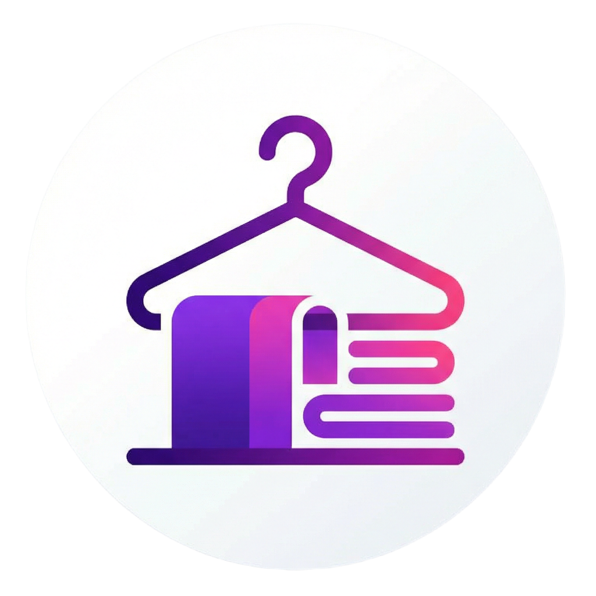

<div align="center">
  
  <h1>ClosetMap - The Wardrobe App</h1>
</div>


ClosetMap is a comprehensive mobile application designed to help you organize and track your wardrobe. It allows you to digitize your closet, manage clothes, and find items quickly.

## Version Information

**Current Release:** v1.2.0
**Release Date:** 2026-01-25

### Release Notes

We are excited to announce the release of version 1.2.0. This release introduces significant improvements to the backend and mobile functionality.

- **Barcode Generation Fixed:** The barcode generation system is now fully functional, allowing for reliable bag tracking and organization.
- **Swagger API Documentation:** Added Swagger UI for real-time API exploration and testing (available at `/api-docs` in dev mode).
- **Cloth Inventory:** The core inventory management system is stable and working as expected.
- **Improved TypeScript Configuration:** Resolved JSX configuration issues for a better development experience.

## Known Issues

- **Color Palette:** The color selection palette is functional but limited. We are planning to expand the color options while ensuring the UI remains user-friendly.
- **Category Classification:** The current category options are broad. We are working on a more discrete and granular classification system to help you organize better.
- **Login Error:** The login functionality is currently experiencing issues after 60 min of login. We are working on a fix to resolve this.

## Getting Started

To run the project locally:

1.  **Backend:**
    ```bash
    cd backend
    npm install
    npm run dev
    ```

2.  **Mobile:**
    ```bash
    cd mobile
    npm install
    npx expo start -c
    ```

## Feedback

We welcome your feedback! Please report any additional bugs or feature requests to our issue tracker.
