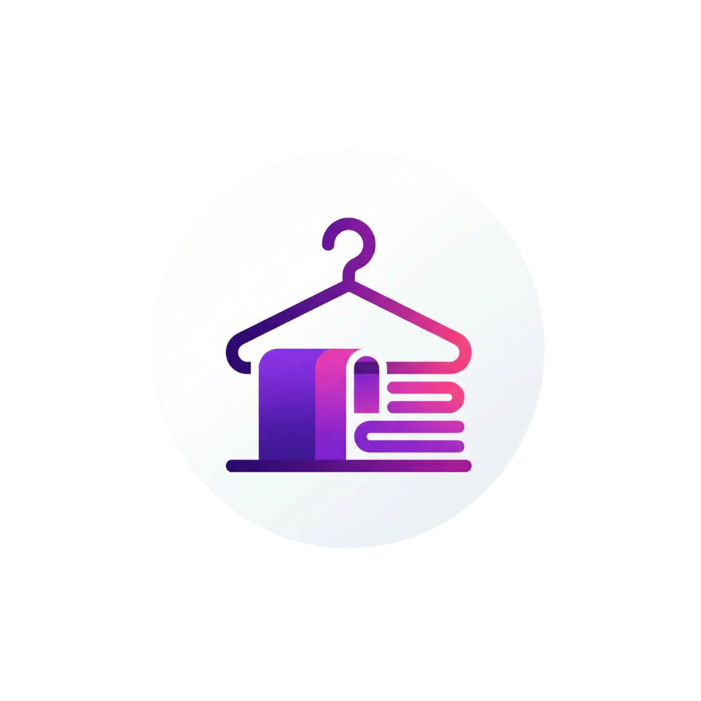

<div align="center">
  
  <h1>ClosetMap - The Wardrobe App</h1>
</div>

<a href="https://github.com/HarshMathur86/Closet-Map-App/releases/download/BETA-version-1.4.0/ClosetMap-Beta-v1.4.0.apk">
  
</a>


ClosetMap is a comprehensive mobile application designed to help you organize and track your wardrobe. It allows you to digitize your closet, manage clothes, and find items quickly.

## Version Information

**Current Release:** v1.4.3
**Release Date:** 2026-05-30

### Release Notes — v1.4.3

This release addresses dependency security vulnerabilities and fixes a critical Android bundling issue.

#### 🐛 Bug Fixes
- **Android Bundling Fixed:** Resolved a Metro bundler crash caused by a missing `buffer` polyfill dependency. The `services/api.ts` module imported `Buffer` from `'buffer'` (used for base64 PDF export), but the package was never added to `package.json`. Installed the `buffer` package to restore successful Android builds.

#### 🔒 Security
- **Dependency Vulnerability Remediation:** Ran `npm audit fix` across both backend and mobile projects, resolving all known vulnerabilities. Both projects now report **0 vulnerabilities** on audit.

---

<details>
<summary><strong>Previous Release — v1.4.2 (2026-04-04)</strong></summary>

#### 🐛 Bug Fixes
- **Android Keyboard Overlap Fixed:** Resolved the issue where the on-screen keyboard would cover input fields (Owner, Notes) in the "Add Cloth" modal. Implemented `react-native-keyboard-aware-scroll-view` with `softwareKeyboardLayoutMode: "resize"` for robust keyboard avoidance.
- **Android Navigation Bar Overlap Fixed:** Fixed UI elements being obscured by the system navigation bar. Applied proper safe area insets across all screens to prevent content from rendering behind system UI.

#### ✨ Improvements
- **Edge-to-Edge Display:** Achieved a fully immersive Android UI where the app footer and system navigation bar blend seamlessly, with dynamic icon contrast based on the app's theme.
- **Safe Area Handling:** Added `useSafeAreaInsets` throughout the app to ensure consistent padding and prevent overlap with system bars on all device types.
- **Version Display Cleanup:** Simplified the version label on the Profile screen — removed the BETA tag and release suffix for a cleaner display.
- **Dependency Security Updates:** Addressed npm audit vulnerabilities in backend dependencies (`fast-xml-parser`, `@tootallnate/once`, and others via overrides).

</details>

<details>
<summary><strong>Previous Release — v1.4.1 (2026-02-24)</strong></summary>

- **Move Items Between Bags Fixed:** Users can now seamlessly move clothes from one bag to another.
- **Color Selection Palette:** Improved the color selection interface for better usability.
- **Login Experience:** Resolved issues with login expiration after 60 minutes.
- **Barcode Generation Fixed:** The barcode generation system is now fully functional, allowing for reliable bag tracking and organization.
- **Swagger API Documentation:** Added Swagger UI for real-time API exploration and testing (available at `/api-docs` in dev mode).
- **Cloth Inventory:** The core inventory management system is stable and working as expected.
- **Improved TypeScript Configuration:** Resolved JSX configuration issues for a better development experience.

</details>

## Known Issues

- **Category Classification:** The current category options are broad. We are working on a more discrete and granular classification system to help you organize better.

## Getting Started

To run the project locally:

1.  **Backend:**
    ```bash
    cd backend
    npm install
    npm run dev
    ```

2.  **Mobile:**
    ```bash
    cd mobile
    npm install
    npx expo start -c
    ```

## Feedback

We welcome your feedback! Please report any additional bugs or feature requests to our issue tracker.
